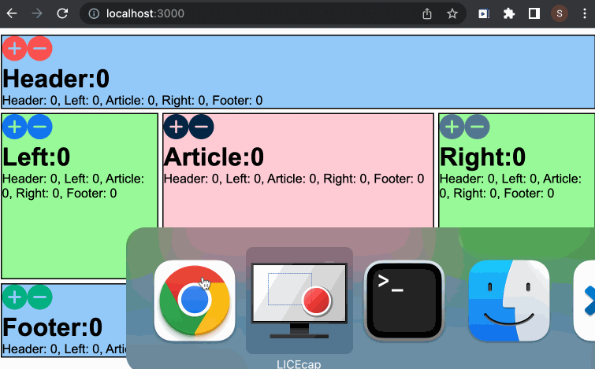

# full_stack_holy_grail
- This project was completed by using REACT, Express, Redis, HTML, JavaScript, and NODE.
- This project was completed as a full-stack application practice.
- This project renders holy-grail layout and users can interact with each part of the display.

## How to run
- Clone this repository.
- Open up terminal at the folder and run follwing code. % npm install
- Once the installation has completed run following code. % node index.js
- Navigate to http://localhost:3000

